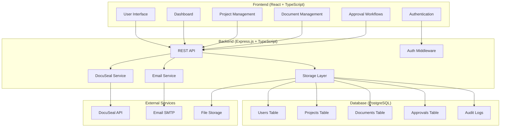
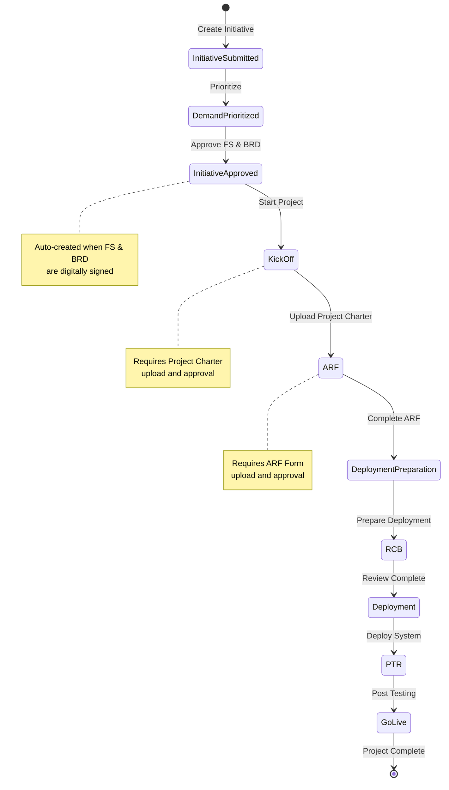
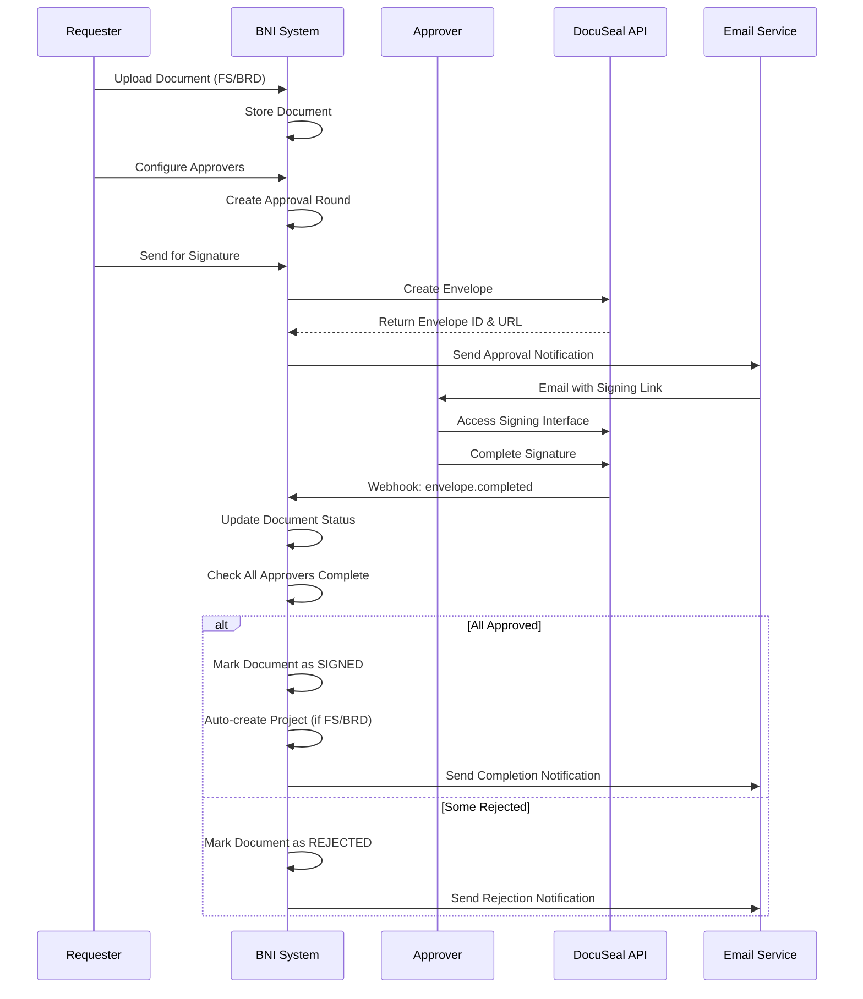
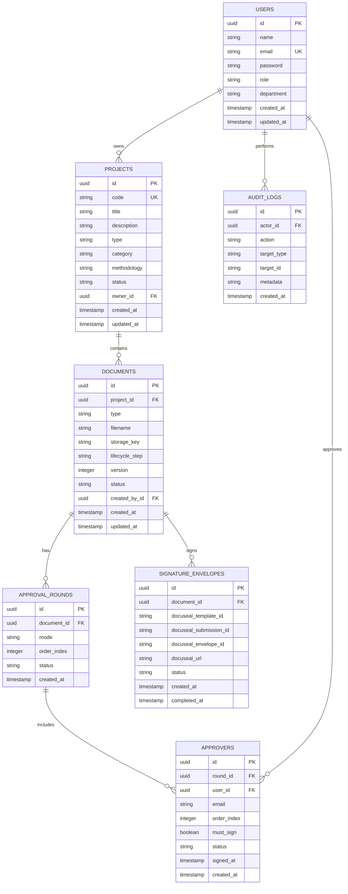
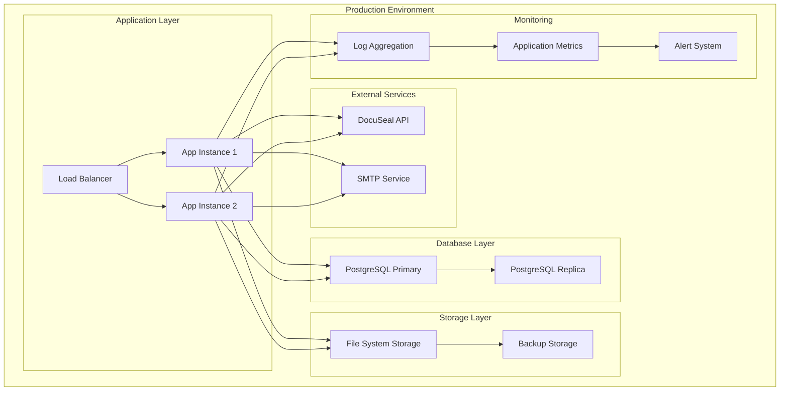

# BNI SDLC Approvals - Architecture Overview

## System Architecture

## SDLC Status Flow

## Document Approval Flow

## Database Schema Overview

## Security Architecture

```mermaid
graph TB
    subgraph "Security Layers"
        subgraph "Authentication"
            Login[Login Form]
            Session[Session Management]
            Passport[Passport.js Strategy]
        end

        subgraph "Authorization"
            RBAC[Role-Based Access Control]
            Guards[Route Guards]
            Permissions[Permission Checks]
        end

        subgraph "Data Protection"
            Validation[Input Validation - Zod]
            Sanitization[Data Sanitization]
            Encryption[Session Encryption]
        end

        subgraph "File Security"
            Upload[File Upload Validation]
            Storage[Secure File Storage]
            Access[Controlled File Access]
        end

        subgraph "Audit & Monitoring"
            Logging[Comprehensive Logging]
            Trails[Audit Trails]
            Monitoring[Activity Monitoring]
        end
    end

    Login --> Session
    Session --> Passport
    Passport --> RBAC
    RBAC --> Guards
    Guards --> Permissions
    Permissions --> Validation
    Validation --> Sanitization
    Sanitization --> Encryption
    Upload --> Storage
    Storage --> Access
    Access --> Logging
    Logging --> Trails
    Trails --> Monitoring
```

## Deployment Architecture

## Key Design Decisions

### 1. Technology Choices
- **TypeScript**: End-to-end type safety from database to UI
- **Drizzle ORM**: Type-safe database operations with excellent TypeScript integration
- **React Query**: Efficient server state management with caching
- **shadcn/ui**: Consistent, accessible component library
- **Wouter**: Lightweight routing for better performance

### 2. Architecture Patterns
- **Layered Architecture**: Clear separation between presentation, business logic, and data layers
- **Repository Pattern**: Abstracted data access through storage interface
- **Command Query Separation**: Separate read and write operations
- **Event-Driven**: Webhook-based integration with external services

### 3. Security Considerations
- **Defense in Depth**: Multiple security layers from frontend to database
- **Principle of Least Privilege**: Role-based access with minimal required permissions
- **Audit Everything**: Comprehensive logging of all user actions
- **Secure by Default**: Safe defaults for all configuration options

### 4. Scalability Considerations
- **Stateless Design**: Session data stored in database for horizontal scaling
- **Database Optimization**: Proper indexing and query optimization
- **File Storage**: Configurable storage backend for cloud migration
- **Caching Strategy**: React Query for client-side caching, database query optimization

### 5. Integration Strategy
- **API-First**: RESTful API design for potential future integrations
- **Webhook Support**: Real-time updates from external services
- **Modular Services**: Loosely coupled services for easier maintenance
- **Configuration-Driven**: Environment-based configuration for different deployments